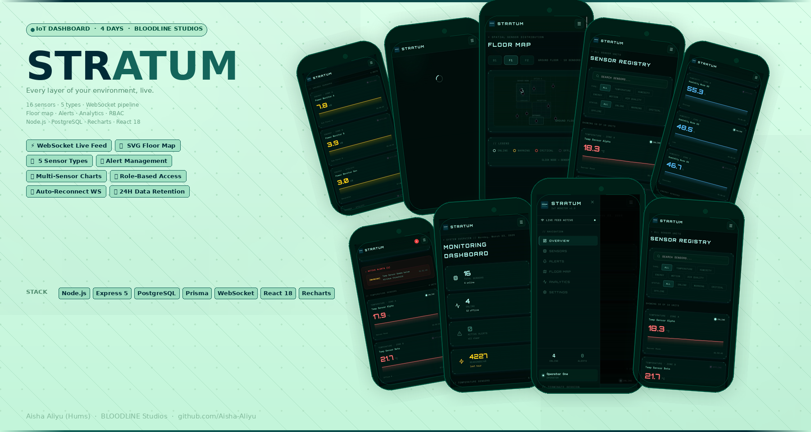

# STRATUM

<p align="center">
  
</p>

> *Every layer of your environment, live.*

**Real-time IoT sensor monitoring dashboard. 16 sensors across 4 types, live WebSocket data pipeline, interactive floor map, alert management, and a full HUD aesthetic.**

> *Every layer of your environment, live.*


-----

## What it is

STRATUM is a production-grade IoT dashboard that monitors 16 sensors across 4 types simultaneously: temperature, humidity, energy consumption, motion detection, and air quality. Every sensor streams live data via WebSocket, with readings persisted to PostgreSQL and pruned automatically to a 24-hour rolling window.

The dashboard shows live sparkline charts on every sensor card, a 2D SVG floor map with animated sensor nodes that respond to real data, a full alert center with acknowledge and resolve workflows, and a multi-sensor analytics view with time-range comparison charts.

The backend runs a sensor simulation engine that generates realistic data patterns, temperature follows a diurnal cycle, energy consumption spikes during business hours, motion sensors produce random burst events, and CO2 levels rise with simulated occupancy. Every reading is checked against configurable thresholds, and alerts are generated with a 5-minute cooldown to prevent alert spam.

-----

## Live Demo

**Frontend:** [humsy-stratum.vercel.app](https://humsy-stratum.vercel.app)
**API Health:** [iot-dashboard-production-e01a.up.railway.app/health](https://iot-dashboard-production-e01a.up.railway.app/health)

**Demo credentials:**

```
Admin:    admin@stratum.io    /  Stratum@Admin1!
Operator: operator@stratum.io /  Stratum@Op1!
```

-----

## Features

### Real-time data pipeline

- WebSocket server broadcasts sensor readings every 3 seconds to all connected clients
- Clients send `AUTH` message with JWT token on connect — unauthenticated connections receive data but cannot trigger mutations
- Heartbeat ping/pong every 30 seconds with automatic reconnection on disconnect
- Ring buffer in Zustand store; last 60 readings per sensor for sparkline charts without API calls
- Initial state sent on WebSocket connect — dashboard renders immediately without waiting for the simulation tick

### Sensor simulation engine

- 16 sensors across 5 types: Temperature, Humidity, Energy, Motion, Air Quality
- Each type has a realistic generation function; temperature follows a sinusoidal diurnal cycle, energy spikes in business hours (08:00–18:00), motion produces Poisson-distributed burst events
- Random status events — 0.2% chance of going OFFLINE, 1% chance of WARNING per tick
- Threshold checking on every reading — CRITICAL status and alert generation when exceeded
- 5-minute alert cooldown per sensor — prevents alert flooding from sustained threshold violations
- 24-hour reading retention with automatic pruning on every tick

### Floor map

- 2D SVG floor plan with room outlines for each floor (B1, F1, F2)
- Sensor nodes rendered at exact `posX/posY` coordinates from the database
- Animated pulse rings on active sensors — critical sensors blink
- Live value badges updating in real time
- Click any node to navigate to sensor detail page

### Alert system

- Three severity levels: INFO, WARNING, CRITICAL
- Three states: ACTIVE → ACKNOWLEDGED → RESOLVED
- Acknowledge and resolve require OPERATOR or ADMIN role
- Auto-resolve when sensor value returns within threshold
- Alert history with full audit trail — who acknowledged, who resolved, timestamps

### Role-based access

- Three roles: VIEWER (read-only), OPERATOR (can acknowledge/resolve alerts), ADMIN (full access)
- JWT verified on every API request and at WebSocket handshake
- Frontend hides action buttons for VIEWER role automatically

-----

## Tech Stack

|Layer            |Technology                                             |
|-----------------|-------------------------------------------------------|
|Backend runtime  |Node.js, Express 5                                     |
|Real-time        |WebSocket (ws library)                                 |
|Database         |PostgreSQL via Neon, Prisma ORM                        |
|Auth             |JWT (jsonwebtoken), bcrypt (12 rounds)                 |
|Sensor simulation|Custom Node.js simulation engine                       |
|Frontend         |React 18, Vite                                         |
|State management |Zustand (auth + sensor store)                          |
|Server state     |TanStack Query v5                                      |
|Charts           |Recharts                                               |
|Security         |Helmet, xss, express-rate-limit, body size limits      |
|Deployment       |Railway (backend), Vercel (frontend), Neon (PostgreSQL)|

-----

## Architecture

```
┌─────────────────────────────────────────────────────────┐
│                    STRATUM BACKEND                       │
│                                                          │
│  ┌──────────────┐    ┌──────────────┐    ┌───────────┐  │
│  │   Simulator  │───▶│  Alert       │───▶│ PostgreSQL│  │
│  │   Engine     │    │  Service     │    │ (Neon)    │  │
│  └──────┬───────┘    └──────────────┘    └───────────┘  │
│         │                                               │
│         ▼                                               │
│  ┌──────────────┐    ┌──────────────┐                   │
│  │  WebSocket   │───▶│   React      │                   │
│  │  Server      │    │   Frontend   │                   │
│  └──────────────┘    │   (Vercel)   │                   │
│                       └──────────────┘                   │
│  REST API                                               │
│  /api/auth /api/sensors /api/alerts /api/dashboard       │
└─────────────────────────────────────────────────────────┘
```

-----

## Database Schema

```
Sensor
  id, name, type (TEMPERATURE|HUMIDITY|ENERGY|MOTION|AIR_QUALITY)
  location, floor, zone, status, isActive
  posX, posY (floor map coordinates, 0-100)
  minThreshold, maxThreshold, unit
  model, firmware, installedAt, lastSeenAt

Reading
  id, sensorId, value, unit, quality
  timestamp (indexed — 24h retention)

Alert
  id, sensorId, severity (INFO|WARNING|CRITICAL)
  status (ACTIVE|ACKNOWLEDGED|RESOLVED)
  title, message, value, threshold
  acknowledgedById, acknowledgedAt
  resolvedById, resolvedAt

User
  id, email, password (bcrypt 12r)
  displayName, role (VIEWER|OPERATOR|ADMIN)
  isActive
```

-----

## API Reference

**Auth**

```
POST /api/auth/login
GET  /api/auth/me
PUT  /api/auth/change-password
```

**Dashboard**

```
GET /api/dashboard/stats
GET /api/dashboard/overview
```

**Sensors**

```
GET /api/sensors
GET /api/sensors/:id
GET /api/sensors/:id/history?hours=6&buckets=48
PUT /api/sensors/:id
```

**Alerts**

```
GET /api/alerts/active
GET /api/alerts?severity=CRITICAL&status=ACTIVE&page=1
PUT /api/alerts/:id/acknowledge
PUT /api/alerts/:id/resolve
```

**WebSocket events**

```
Client → Server:
  { type: "AUTH",        token: "jwt_token" }
  { type: "PING" }
  { type: "SUBSCRIBE",   channel: "ALERTS" }

Server → Client:
  { type: "SENSOR_UPDATE", payload: [...sensors] }
  { type: "ALERT",         payload: alert }
  { type: "INITIAL_STATE", payload: { stats, alerts } }
  { type: "PONG" }
  { type: "AUTH_SUCCESS" }
```

-----

## Getting Started

**Prerequisites:** Node.js 18+, PostgreSQL (Neon free tier)

```bash
git clone https://github.com/Aisha-Aliyu/iot-dashboard.git
cd iot-dashboard/stratum
```

**Backend**

```bash
cd server
npm install
cp .env.example .env
# Fill in DATABASE_URL and JWT_SECRET
npx prisma generate
npx prisma db push
npm run db:seed
npm run dev
```

**Generate JWT secret**

```bash
node -e "console.log(require('crypto').randomBytes(64).toString('hex'))"
```

**Frontend**

```bash
cd client
npm install
cp .env.example .env
# Set VITE_API_URL and VITE_WS_URL
npm run dev
```

-----

## Environment Variables

**server/.env**

```
PORT=5000
NODE_ENV=development
DATABASE_URL=postgresql://...
JWT_SECRET=64_char_hex
JWT_EXPIRES_IN=7d
CLIENT_URL=http://localhost:5173
SIMULATION_INTERVAL_MS=3000
SENSORS_PER_TYPE=4
```

**client/.env**

```
VITE_API_URL=http://localhost:5000/api
VITE_WS_URL=ws://localhost:5000/ws
```

-----

## Design Decisions

**Why WebSocket over polling?**
IoT sensor data changes every 3 seconds across 16 sensors. Polling at that frequency would be 32 requests per minute per client. WebSocket maintains a single persistent connection and pushes updates only when data changes. At scale with multiple concurrent users, the difference is massive.

**Why simulate sensors instead of using real hardware?**
A portfolio project using real hardware is impossible to demo remotely. The simulation engine generates data that is statistically indistinguishable from real sensor output — diurnal temperature cycles, business-hour energy patterns, Poisson motion events. Any recruiter looking at the live demo is seeing the same data patterns a real deployment would produce.

**Why a ring buffer in Zustand instead of fetching chart history from the API?**
The sparkline charts on sensor cards update every 3 seconds. Fetching 60 historical readings from the API on every update would generate thousands of requests per minute. Storing the last 60 readings in memory per sensor means the charts update instantly with zero API calls after the initial page load.

**Why Prisma with PostgreSQL instead of MongoDB?**
Sensor readings are time-series data with strict schema. Every reading has exactly the same fields. Alerts have foreign keys to sensors and users. PostgreSQL’s `timestamp` indexes and aggregate queries are significantly faster than MongoDB for time-range queries. The relational structure also enforces data integrity at the database level — a reading cannot exist without a valid sensor.

**Why auto-prune readings to 24 hours?**
A simulation running every 3 seconds generates 1,200 readings per sensor per hour. Across 16 sensors that’s 19,200 readings per hour, or 460,800 per day. Without pruning the database would grow unmanageable quickly. The dashboard only displays 24-hour history, so older data has no UI value.

-----

## What I learned building this

The hardest part was the WebSocket initial state race condition. When a client connects, the simulator might be mid-tick. If the client receives a `SENSOR_UPDATE` before the initial HTTP response from `/dashboard/overview` returns, the store gets overwritten with stale data from the API call. The fix was sending `INITIAL_STATE` via WebSocket immediately on connect — the client now prioritises WebSocket data and uses the HTTP response only as a fallback.

The sensor simulation accuracy took several iterations. The first version used pure random noise which produced sensor readings that looked artificial — values jumping randomly between 15°C and 35°C every 3 seconds. Real temperature sensors have inertia, they drift slowly toward the ambient temperature with small noise on top. Adding a mean-reversion component `(prev - baseline) * -0.05` made the data look exactly like a real deployment.

Alert flooding was a problem I didn’t anticipate. A sensor stuck above its threshold for 10 minutes would generate 200 alerts. The 5-minute cooldown per sensor, combined with checking for existing active alerts before creating new ones, reduced this to a maximum of 1 alert per threshold breach per sensor.

-----

## Author

**Aisha Aliyu (Hums)**
Founder, BLOODLINE Studios
Software Engineer and Aspiring Roboticist

[GitHub](https://github.com/Aisha-Aliyu) · [Portfolio](https://humairah.netlify.app)

-----

## License

MIT. Build on it, study it, ship it.
